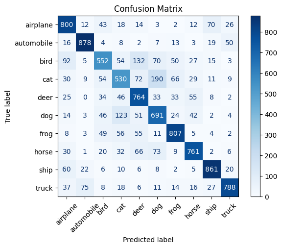

# CIFAR-10 Image Classification using CNN (TensorFlow/Keras)

This project implements a Convolutional Neural Network (CNN) for classifying images from the CIFAR-10 dataset. The model is built using TensorFlow and Keras, trained and evaluated with visualizations, metrics, and performance reports.

---

## Dataset

- **Dataset Used**: CIFAR-10
- **Classes**: 
  - `airplane`, `automobile`, `bird`, `cat`, `deer`, `dog`, `frog`, `horse`, `ship`, `truck`
- **Image Size**: 32x32 RGB images
- **Total Images**: 60,000 (50,000 train + 10,000 test)

---

## Model Architecture

The CNN architecture includes:
- 3 Convolutional Layers with ReLU activation
- MaxPooling layers after each convolution
- Flatten layer
- 2 Fully Connected (Dense) layers
- Softmax output for multi-class classification

```python
model = Sequential()
model.add(Conv2D(32, (3, 3), activation='relu', input_shape=(32, 32, 3)))
model.add(MaxPooling2D((2, 2)))
model.add(Conv2D(64, (3, 3), activation='relu'))
model.add(MaxPooling2D((2, 2)))
model.add(Conv2D(64, (3, 3), activation='relu'))
model.add(Flatten())
model.add(Dense(64, activation='relu'))
model.add(Dense(10))
````

---

## Results

* **Test Accuracy**: \~74%
* **Test Loss**: \~0.75
* **Optimizer**: Adam
* **Loss Function**: Sparse Categorical Crossentropy
* **EarlyStopping**: Enabled (patience=5, restore best weights)

---

## 📊 Visualizations

### 🔢 Accuracy Over Epochs


### 📉 Loss Over Epochs


### 🔁 Confusion Matrix



### 🖼️ Predicted vs True Labels


